# OSH Lab 1 Report - Tracing Linux Startup
<div align="right"><strong>吴永基 PB16001676</strong></div>

## 实验环境配置
本次实验所采用的操作环境
- Ubuntu 17.10 x64 (Linux version 4.13.0-32-generic (buildd@lgw01-amd64-016) (gcc version 7.2.0 (Ubuntu 7.2.0-8ubuntu3)))
- gdb 8.0.1
- gcc 7.2.0
- qemu 2.12.0-rc0 
- busybox 1.28.1
通过qemu模拟器+gdb追踪分析`linux-4.1.50`内核的启动过程。
### 环境搭建
#### 内核编译
从[kernel.org](https://www.kernel.org)获取4.1.50版的Linux内核源码，并在本地编译。
```bash
sudo apt-get install libncurses5-dev libncursesw5-dev
make clean
make menuconfig
make x86_64_defconfig
make
```
在`make menuconfig`一步，进入内核配置菜单，选择`Kernel hacking`->`Compile-time checks and compiler options`->勾选`Compile the kernel with debug info` 
#### qemu编译
之后从[qemu.org](https://www.qemu.org)获取qemu 2.12.0-rc0版，并编译安装
```bash
sudo apt-get install git libglib2.0-dev libfdt-dev libpixman-1-dev zlib1g-dev
make clean
./configure
make
make install
```
#### 用busybox制作根文件系统（RootFS）
获取busybox 1.28.1版本
`wget http://busybox.net/downloads/busybox-1.28.1.tar.bz2`

```bash
make menuconfig
make
make install
```
其中menuconfig中勾选`Settings` -> `Build Options` -> `Build static binary (no shared libs)`
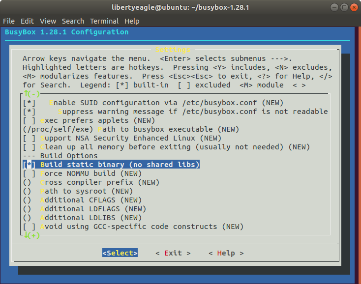
更新文件系统
```bash
cd _install
mkdir proc sys dev etc etc/init.d
touch _install/etc/init.d/rcS
```
然后编辑`rcS`文件，修改为以下内容
```
#!/bin/sh
mount -t proc none /proc
mount -t sysfs none /sys
/sbin/mdev -s
```
接下来修改`rcS`属性为可执行
`chmod +x _install/etc/init.d/rcS`
创建镜像
```bash
cd _install
find . | cpio -o --format=newc > ../rootfs.img
```
### 调试
我们使用下述命令启动qemu模拟器
`qemu-system-x86_64 -kernel ./arch/x86_64/boot/bzImage -initrd rootfs.img  -append "console=tty1 root=/dev/ram rdinit=/sbin/init" -S -s`
然后使用gdb调试，为了方便，我们使用tui模式操作。将第一个断点设置在`start_kernel()`函数处
```
gdb -tui
(gdb) file vmlinux # 加载符号表
(gdb) target remote:1234 # 连接远程目标
(gdb) break start_point
(gdb) c # continue
```
之后我们可以看到，qemu停在了内核引导的位置
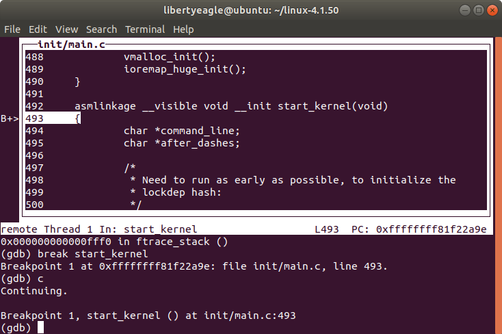
使用VNC连接远程桌面，可以看到
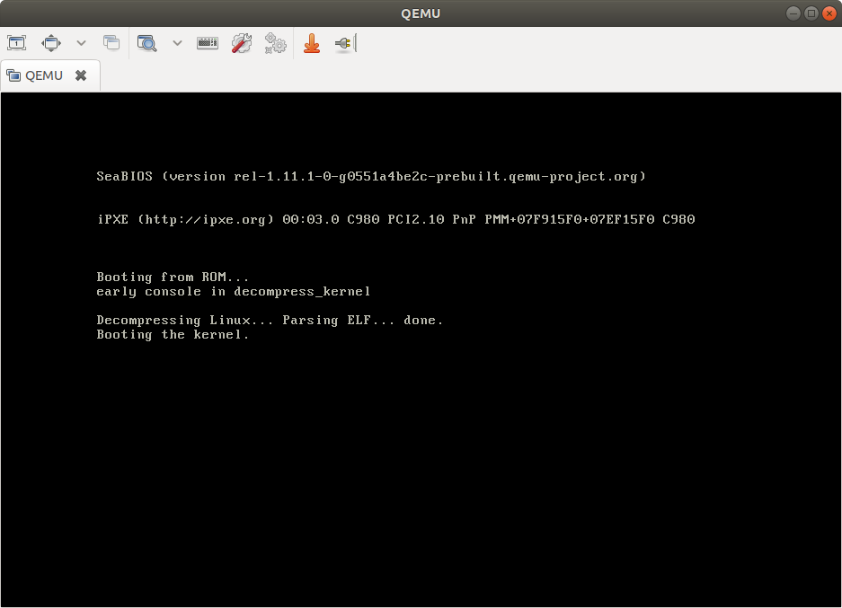

## `start_kernel` - Linux内核的`main`函数
### 总揽
在完成内核初始化前的一系列预备工作后，`x86_64_start_reservations()`函数便会调用`start_kernel`。`start_kernel()`中调用了一系列初始化函数，以完成核心数据结构的初始化。它的主要目的是完成内核的初始化过程并且启动第一个`init`进程。
`start_kernel()`会调用一系列初始化函数来设置中断，执行进一步的内存配置，并加载初始 RAM 磁盘
**`start_kernel`的主要流程**
- 初始化lock validator (lockdep_init)
- 设置操作系统的第一个进程init (set_task_stack_end_magic)
- 设置`obj_hash`, `obj_static_pool`两个全局变量
- 设定不确定的stack canary，阻止buffer overflow攻击 (boot_init_stack_canary)
- 初始化control groups (cgroup_init_early)
- 关闭中断操作 (local_irq_disable)
- 完成页地址的初始化 (page_address_init)
- 打印linux_banner (pr_notice)
- 内核架构相关初始化函数，包含处理器相关参数的初始化、内核启动参数的获取和前期处理、内存子系统的早期初始化 (setup_arch)
- 为SMP系统里引导CPU进行准备工作 (smp_prepare_boot_cpu)
- 设置内存页分配通知器 (page_alloc_init)
- 中断描述符号表初始化 (trap_init)
- 初始化内存管理器 (mm_init)
- 对进程调度器的数据结构进行初始化 (sched_init)
- 初始化直接读拷贝更新的锁机制 (rcu_init)
- 中断管理系统的早期初始化 (early_irq_init)
- 初始化软件中断 (softirq_init)
- 初始化系统时钟，开启一个硬件定时器 (time_init)
- 启用中断操作 (local_irq_enable)
- 控制台初始化 (console_init)
- 完成剩余部分 (rest_init)
在刚开始我们可以看到两个字符串变量`command_line`和`after_dashes`，我们可以用gdb看到他们的值
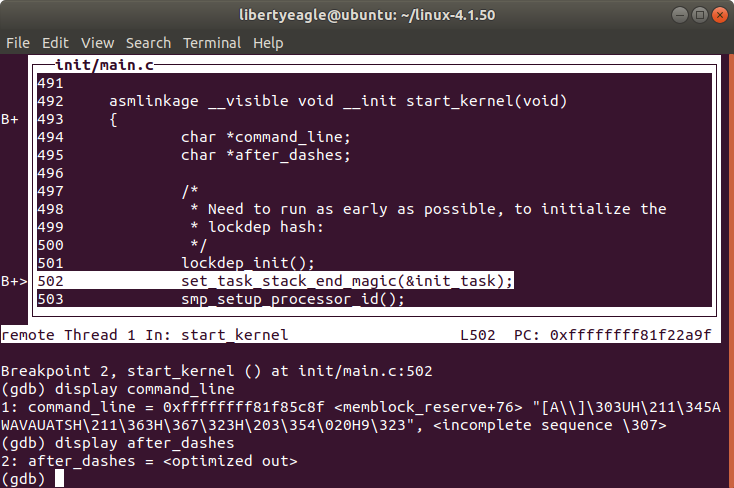
可以看到该部分的一些汇编代码
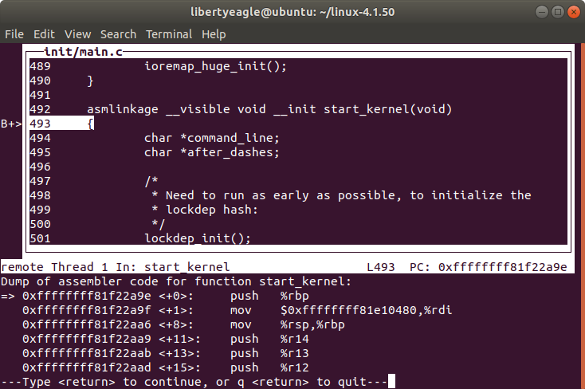
在`start_kernel()`，我们看到其调用的第一个函数是`lockdep_init()`，这个函数会初始化内核死锁检测机制的哈希表。接下来，会调用`	set_task_stack_end_magic(&init_task)`函数
## `set_task_stack_end_magic()`
用gdb设置断点，我们可以看到这部分的代码
```
set_task_stack_end_magic(struct task_struct *tsk)
{
	unsigned long *stackend;
  stackend = end_of_stack(tsk);
  *stackend = STACK_END_MAGIC;	/* for overflow detection */
}
```
`set_task_stack_end_magic()`函数将栈底地址设置为`STACK_END_MAGIC`，作为溢出的标记（canary）
`init_task`代表下面的初始任务结构
`struct task_struct init_task = INIT_TASK(init_task);`
其中，`task_struct`存储了关于一个进程的所有信息。这个结构在`include/linux/init_task.h`中定义。`init_task`被`INIT_TASK`宏初始化，以完成第一个进程的配置
- 将进程的状态置为`runnable`
- 将进程的标记置为`PF_KTHREAD` (kernel thread)
- 配置一个`runnable`的task list
- 配置进程的地址空间
之后会初始化进程的内核态堆栈，由`thread_union`结构表示
```c
union thread_union {
#ifndef CONFIG_THREAD_INFO_IN_TASK
	struct thread_info thread_info;
#endif
	unsigned long stack[THREAD_SIZE/sizeof(long)];
};
```
在`include/linux/sched.h`中可以找到
其中`thread_info`的定义在`arch/x86/arch/x86/include/asm/thread_info.h`中
```c
struct thread_info {
	struct task_struct	*task;		/* main task structure */
	struct exec_domain	*exec_domain;	/* execution domain */
	__u32			flags;		/* low level flags */
	__u32			status;		/* thread synchronous flags */
	__u32			cpu;		/* current CPU */
	int			saved_preempt_count;
	mm_segment_t		addr_limit;
	struct restart_block    restart_block;
	void __user		*sysenter_return;
	unsigned int		sig_on_uaccess_error:1;
	unsigned int		uaccess_err:1;	/* uaccess failed */
};
```
### `smp_setup_processor_id()`
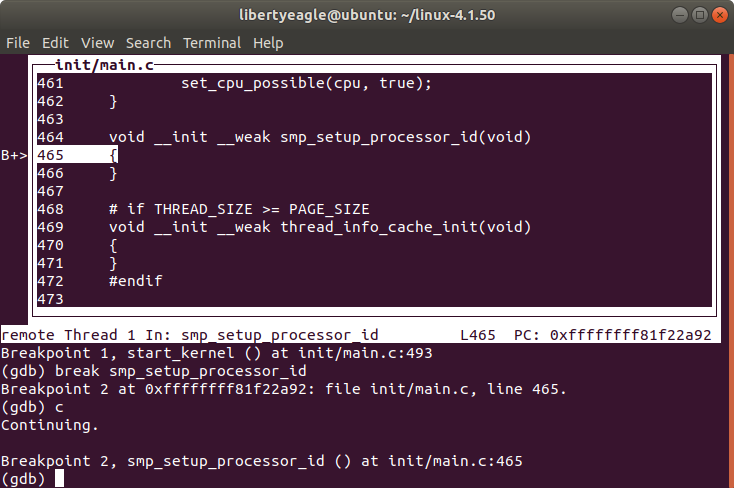
`smp_setup_process_id()`中`smp`指的是symmetric multi-processor，与之对应的是NUMA和MPP。用以设置SMP模型的CPU ID
```c
# if THREAD_SIZE >= PAGE_SIZE
void __init __weak thread_info_cache_init(void)
{
}
#endif
```
### `cgroup_init_early()`
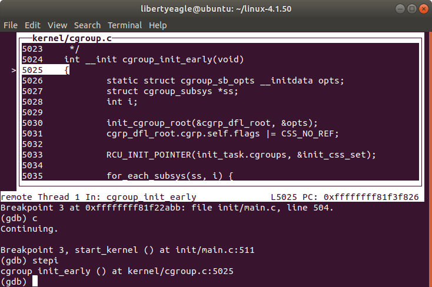
该函数定义在`kernel/cgroup.c`中，在系统启动时初始化control groups，并且初始化任何需要early init的子系统
其中`cgroup_subsys`结构的定义可以在`include/linux/cgroup-defs.h`中找到
```c
struct cgroup_subsys {
	struct cgroup_subsys_state *(*css_alloc)(struct cgroup_subsys_state *parent_css);
	int (*css_online)(struct cgroup_subsys_state *css);
	void (*css_offline)(struct cgroup_subsys_state *css);
	void (*css_released)(struct cgroup_subsys_state *css);
	void (*css_free)(struct cgroup_subsys_state *css);
	void (*css_reset)(struct cgroup_subsys_state *css);
	void (*css_e_css_changed)(struct cgroup_subsys_state *css);

	int (*can_attach)(struct cgroup_subsys_state *css,
			  struct cgroup_taskset *tset);
	void (*cancel_attach)(struct cgroup_subsys_state *css,
			      struct cgroup_taskset *tset);
	void (*attach)(struct cgroup_subsys_state *css,
		       struct cgroup_taskset *tset);
	void (*fork)(struct task_struct *task);
	void (*exit)(struct cgroup_subsys_state *css,
		     struct cgroup_subsys_state *old_css,
		     struct task_struct *task);
	void (*bind)(struct cgroup_subsys_state *root_css);

	int disabled;
	int early_init;

	/*
	 * If %false, this subsystem is properly hierarchical -
	 * configuration, resource accounting and restriction on a parent
	 * cgroup cover those of its children.  If %true, hierarchy support
	 * is broken in some ways - some subsystems ignore hierarchy
	 * completely while others are only implemented half-way.
	 *
	 * It's now disallowed to create nested cgroups if the subsystem is
	 * broken and cgroup core will emit a warning message on such
	 * cases.  Eventually, all subsystems will be made properly
	 * hierarchical and this will go away.
	 */
	bool broken_hierarchy;
	bool warned_broken_hierarchy;

	/* the following two fields are initialized automtically during boot */
	int id;
	const char *name;

	/* link to parent, protected by cgroup_lock() */
	struct cgroup_root *root;

	/* idr for css->id */
	struct idr css_idr;

	/*
	 * List of cftypes.  Each entry is the first entry of an array
	 * terminated by zero length name.
	 */
	struct list_head cfts;

	/*
	 * Base cftypes which are automatically registered.  The two can
	 * point to the same array.
	 */
	struct cftype *dfl_cftypes;	/* for the default hierarchy */
	struct cftype *legacy_cftypes;	/* for the legacy hierarchies */

	/*
	 * A subsystem may depend on other subsystems.  When such subsystem
	 * is enabled on a cgroup, the depended-upon subsystems are enabled
	 * together if available.  Subsystems enabled due to dependency are
	 * not visible to userland until explicitly enabled.  The following
	 * specifies the mask of subsystems that this one depends on.
	 */
	unsigned int depends_on;
};
```
`cgroup_sb_opts`则在同一文件(`cgroup.c`)中
```c
struct cgroup_sb_opts {
	unsigned int subsys_mask;
	unsigned int flags;
	char *release_agent;
	bool cpuset_clone_children;
	char *name;
	/* User explicitly requested empty subsystem */
	bool none;
};
```
### `boot_cpu_init()`
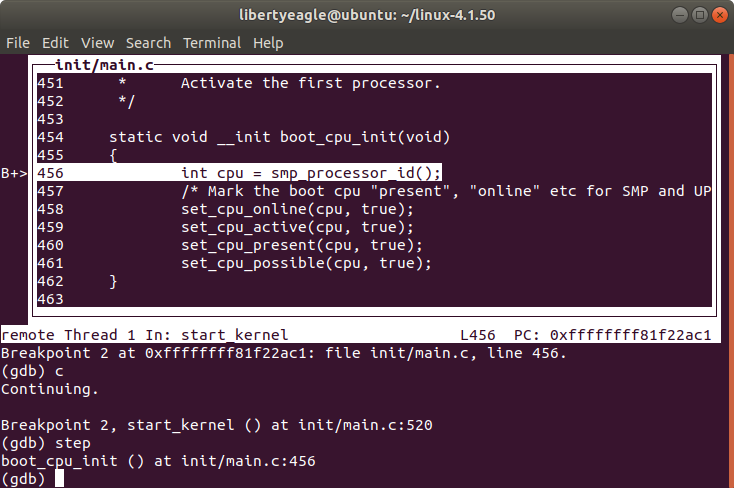
该函数激活第一个CPU，先取得CPU的ID，然后将该CPU标记为`online`, `active`, `present`, `possible`
```c
static void __init boot_cpu_init(void)
{
	int cpu = smp_processor_id();
	/* Mark the boot cpu "present", "online" etc for SMP and UP case */
	set_cpu_online(cpu, true);
	set_cpu_active(cpu, true);
	set_cpu_present(cpu, true);
	set_cpu_possible(cpu, true);
}
```
### `pr_notice("%s", linux_banner)`
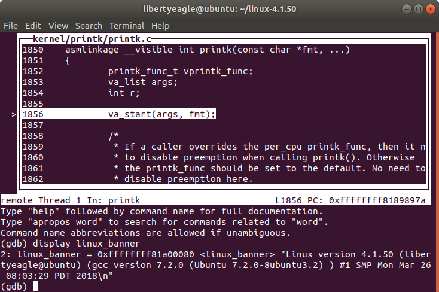
这一步会调用`printk()`打印`linux_banner`
printk函数在`kernel/printk/printk.c`中
我们用gdb可以看出其内容是
`Linux version 4.1.50 (libertyeagle@ubuntu) (gcc version 7.2.0 (Ubuntu 7.2.0-8ubuntu3.2) ) #1 SMP Mon Mar 26 08:03:29 PDT 2018\n`
### `setup_arch(&command_line)`
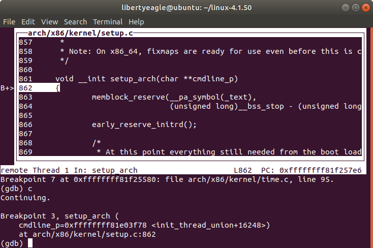
这一部分为体系结构的初始化函数，定义在`arch/x86/kernel/setup.c`中，接受`command_line`为参数
### `trap_init`
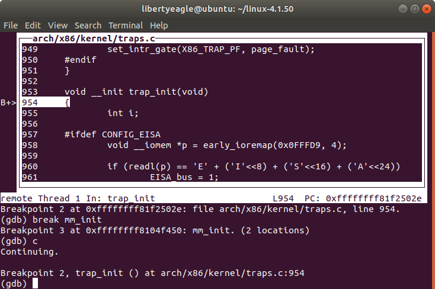
这一部分定义在`arch/x86/kernel.tarps.c`中，用来构建中断描述符号表
可以观察出一些关键部分
```
	set_intr_gate(X86_TRAP_DE, divide_error);
	set_intr_gate_ist(X86_TRAP_NMI, &nmi, NMI_STACK);
	/* int4 can be called from all */
	set_system_intr_gate(X86_TRAP_OF, &overflow);
	set_intr_gate(X86_TRAP_BR, bounds);
	set_intr_gate(X86_TRAP_UD, invalid_op);
	set_intr_gate(X86_TRAP_NM, device_not_available);
	set_intr_gate_ist(X86_TRAP_DF, &double_fault, DOUBLEFAULT_STACK);
	set_intr_gate(X86_TRAP_OLD_MF, coprocessor_segment_overrun);
	set_intr_gate(X86_TRAP_TS, invalid_TSS);
	set_intr_gate(X86_TRAP_NP, segment_not_present);
	set_intr_gate(X86_TRAP_SS, stack_segment);
	set_intr_gate(X86_TRAP_GP, general_protection);
	set_intr_gate(X86_TRAP_SPURIOUS, spurious_interrupt_bug);
	set_intr_gate(X86_TRAP_MF, coprocessor_error);
	set_intr_gate(X86_TRAP_AC, alignment_check);
```
可以看出来这部分代码定义了各种exception，例如
- `#DE` -> 被0除
- `#NMI` -> 不可屏蔽中断（Non-maskable Interrupt）
- `#0F` -> 溢出
- `#BR` -> 边界检查错误
- `#UD` -> 无效指令（Invalid Opcode）
- `#NM` -> 设备不可用
### `mm_init()`
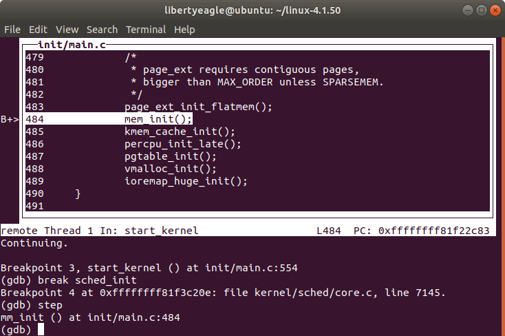
该函数就在`init/main.c`中，内容如下
```c
static void __init mm_init(void)
{
	/*
	 * page_ext requires contiguous pages,
	 * bigger than MAX_ORDER unless SPARSEMEM.
	 */
	page_ext_init_flatmem();
	mem_initp();
	kmem_cache_init();
	percpu_init_late();
	pgtable_init();
	vmalloc_init();
	ioremap_huge_init();
}
```
其中`page_ext_init_flatmem`与`CONFIG_SPARSEMEM`有关，`mem_init`释放所有`bootmem`，`kmem_cahce_init`初始化内核缓存，`vmalloc_init`初始化`vmalloc`
### `sched_init()`
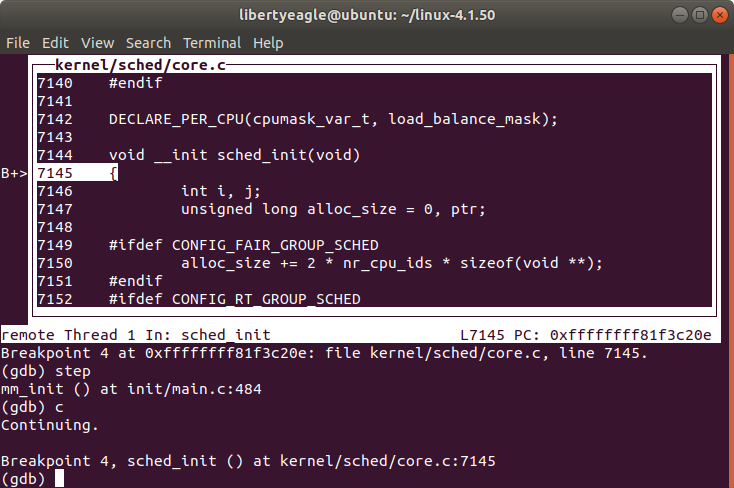
定义在`kernel/sched/core.c`中，主要目的是
- 对相关数据结构分配内存
- 初始化root_task_group
- 初始化每个CPU的rq队列(包括其中的cfs队列和实时进程队列)
- 将init_task进程转变为idle进程
其中我们可以看到
```c
	for_each_possible_cpu(i) {
		struct rq *rq;

		rq = cpu_rq(i);
		raw_spin_lock_init(&rq->lock);
		rq->nr_running = 0;
		rq->calc_load_active = 0;
		rq->calc_load_update = jiffies + LOAD_FREQ;
		init_cfs_rq(&rq->cfs);
		init_rt_rq(&rq->rt);
		init_dl_rq(&rq->dl);
```
这部分代码遍历设置每一个处在`possible`状态的CPU，为其中的每一个CPU初始化一个`runqueue`队列
### `time_init()`
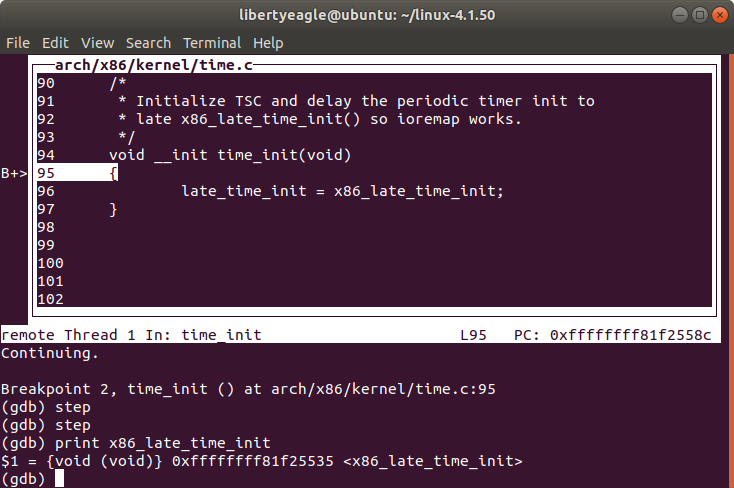
用`x86_late_time_init`初始化event timer，该代码在`arch/x86/kernel/time.c`中
### `console_init()`
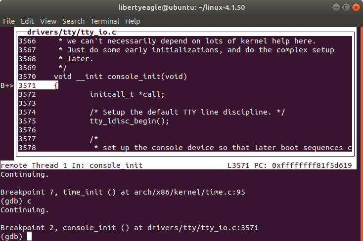
在`drivers/tty/tty_io.c`中，用于初始化控制台，在这里仅完成一些early initializations
### `rest_init()`
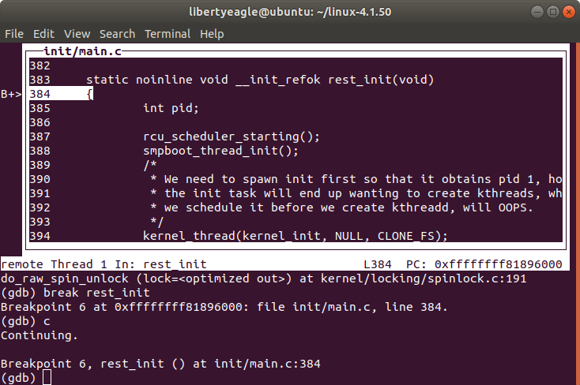
这是`start_kernel()`最后调用的函数，进一步完成内核的初始化
```c
static noinline void __init_refok rest_init(void)
{
	int pid;

	rcu_scheduler_starting();
	smpboot_thread_init();
	/*
	 * We need to spawn init first so that it obtains pid 1, however
	 * the init task will end up wanting to create kthreads, which, if
	 * we schedule it before we create kthreadd, will OOPS.
	 */
	kernel_thread(kernel_init, NULL, CLONE_FS);
	numa_default_policy();
	pid = kernel_thread(kthreadd, NULL, CLONE_FS | CLONE_FILES);
	rcu_read_lock();
	kthreadd_task = find_task_by_pid_ns(pid, &init_pid_ns);
	rcu_read_unlock();
	complete(&kthreadd_done);

	/*
	 * The boot idle thread must execute schedule()
	 * at least once to get things moving:
	 */
	init_idle_bootup_task(current);
	schedule_preempt_disabled();
	/* Call into cpu_idle with preempt disabled */
	cpu_startup_entry(CPUHP_ONLINE);
}
```
例如，`rest_init()`首先会完成RCU调度器的启动
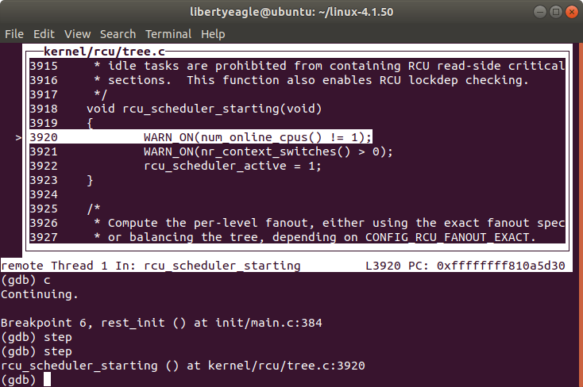
```c
void rcu_scheduler_starting(void)
{
    WARN_ON(num_online_cpus() != 1);
    WARN_ON(nr_context_switches() > 0);
    rcu_scheduler_active = 1;
}
```
首先会确保当前只有一个CPU在线，且没有上下文切换，之后会将RCU使能
## 启动完成
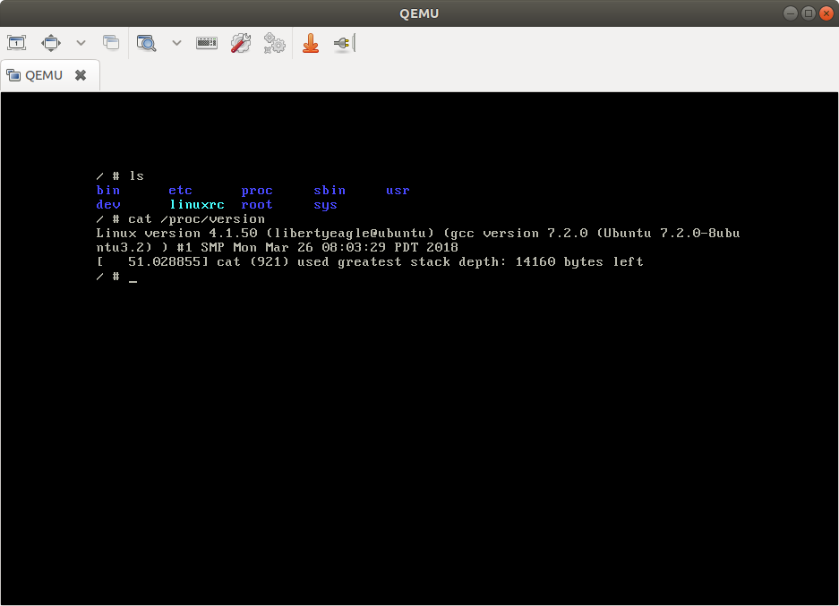